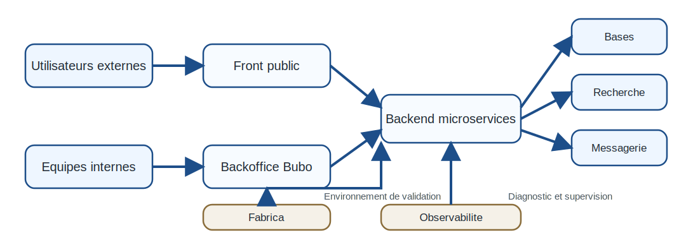
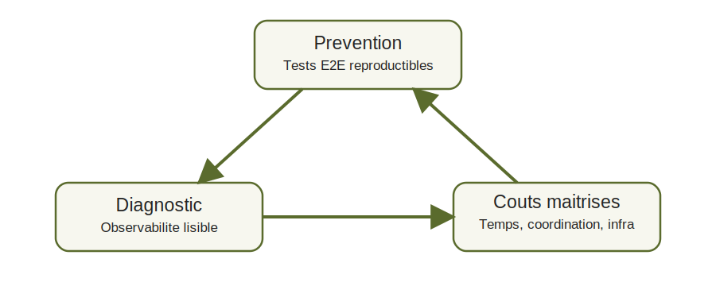
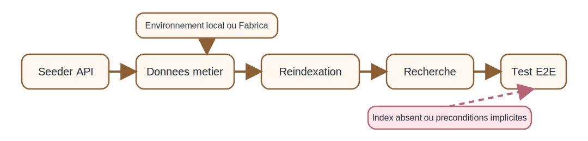
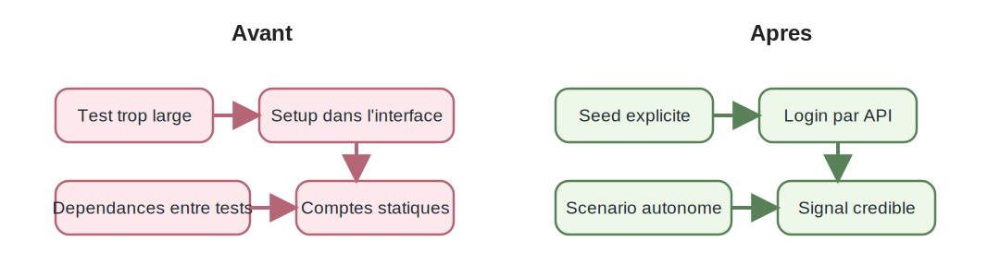
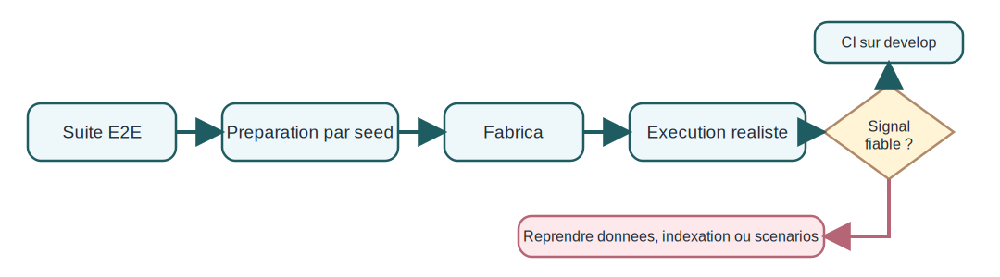
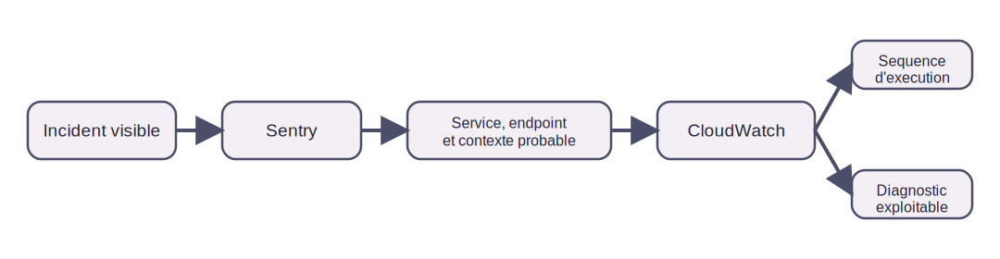

= Faire de la fiabilité opérationnelle un levier intrapreneurial chez LeHibou : stabilisation des tests end-to-end, observabilité et maîtrise des coûts
Hugo Ponthieu
:doctype: article
:toc:
:toclevels: 2
:sectnums:
:title-page:
:icons: font
:pdf-themesdir: {docdir}
:pdf-theme: theme.yml

== Introduction

=== Présentation du sujet

La mission étudiée dans ce rapport prend place dans un contexte où la
croissance d'un système numérique ne se mesure pas seulement à la richesse de
ses fonctionnalités, mais aussi à la capacité de l'organisation à les faire
évoluer sans dégrader la qualité du service rendu. Chez LeHibou, cette
question se pose avec une acuité particulière, car la chaîne de valeur repose
sur un ensemble technique distribué qui articule un <<lexique-front-public,front public>>, une <<lexique-backoffice,interface d'administration>>
interne, un <<lexique-backend,backend>> en <<lexique-microservice,microservices>> et une couche d'infrastructure permettant
de déployer des environnements temporaires proches du réel. Dans un tel cadre,
la fiabilité opérationnelle ne constitue pas un sujet annexe réservé à la seule
exploitation. Elle devient une condition de la fluidité de livraison, de la
lisibilité des incidents et, plus largement, de la confiance que les équipes
peuvent accorder à leurs propres outils.

Le point d'entrée concret de la mission se situe dans la stabilisation des
tests end-to-end. Ce choix n'a rien d'anecdotique. Les validations E2E portent
sur des parcours qui traversent plusieurs couches du système, depuis les
interfaces jusqu'aux services métier et aux données nécessaires à l'exécution
des scénarios. Lorsqu'elles sont robustes, elles peuvent jouer un rôle de filet
de sécurité avant intégration et de support à l'automatisation. Lorsqu'elles
restent fragiles, elles produisent au contraire un signal ambivalent :
elles ralentissent les merges, exigent des vérifications manuelles
complémentaires et entretiennent une forme de doute sur la réalité des
régressions détectées. L'enjeu n'est donc pas seulement de "faire passer des
tests", mais de rendre crédible un dispositif de validation dans un système où
les dépendances sont nombreuses.

Les éléments observés dans l'écosystème LeHibou confirment d'ailleurs que cette
question dépasse largement le seul périmètre d'un front-end. Le front public
cumule des fonctions d'acquisition, de recherche, d'authentification et de
parcours métier. <<lexique-bubo,Bubo>> joue un rôle central pour les opérations internes, avec
des flux liés aux leads, aux candidats, aux contrats ou encore au suivi de
mission. En arrière-plan, le backend rassemble un ensemble étendu de services
spécialisés, reliés à plusieurs bases de données, à des mécanismes de
messagerie et à un moteur de recherche. Cette profondeur fonctionnelle explique
pourquoi la validation de bout en bout ne peut pas reposer durablement sur des
préconditions implicites, des comptes partagés ou des données de test maintenues
de manière artisanale.

La mission s'inscrit ainsi dans une lecture intrapreneuriale de la fiabilité.
Il ne s'agit pas seulement de corriger un irritant local, mais de transformer
une difficulté récurrente en capacité collective. La mise en place progressive
d'un <<lexique-seeding,seeding>> plus explicite, l'usage d'environnements <<lexique-fabrica,Fabrica>> pour rapprocher
la validation de conditions d'exécution réalistes, puis l'amélioration de la
lisibilité des incidents à travers <<lexique-sentry,Sentry>> et <<lexique-cloudwatch,CloudWatch>> relèvent d'une même
logique. L'objectif est de mieux maîtriser le risque sans multiplier à
l'infini les contrôles humains, les coordinations ad hoc et les reprises
manuelles. Autrement dit, la mission relie directement des choix techniques à
des enjeux d'efficacité opérationnelle, de qualité de service et de maîtrise
des coûts.

.Vue d'ensemble simplifiée de l'écosystème technique

=== Problématique

Le cœur du problème peut se formuler de la manière suivante : comment
fiabiliser un système plus riche, plus distribué et plus réaliste sans
augmenter de façon disproportionnée le coût de sa vérification et de son
diagnostic ? La question est structurante, car l'architecture observée montre
que LeHibou ne repose ni sur une application monolithique simple à simuler, ni
sur un environnement unique suffisant pour toutes les validations. Le backend
orchestralise de nombreux services, les interfaces couvrent des publics et des
usages différents, et Fabrica cherche précisément à reconstruire des
environnements éphémères complets avec des données proches de la production.
Dans ce contexte, la fiabilité ne peut pas être obtenue par une simple
addition d'outils ; elle  dépend de la qualité des articulations entre tests,
données, environnements et <<lexique-observabilite,observabilité>>.

Du côté des tests end-to-end, plusieurs limites apparaissent. D'abord, certains
scénarios restent sensibles à la machine d'exécution ou à l'état préalable des
données. Ensuite, une partie des parcours  dépend encore de comptes statiques,
de setups implicites ou de chaînages entre scénarios qui affaiblissent
l'autonomie des suites. Enfin, la question des données ne se réduit pas à la
création initiale d'entités. Elle implique aussi la disponibilité de jeux de
données cohérents à travers plusieurs domaines métier, la capacité à nettoyer
ce qui a été créé pour éviter la pollution inter-tests, ainsi que la
reindexation des moteurs de recherche après seeding afin que les parcours
basés sur la recherche produisent un résultat fiable. Ces difficultés montrent
que la fragilité des E2E relève autant d'un problème de modélisation du
contexte d'exécution que d'un problème de script de test.

La problématique ne s'arrête cependant pas à la prévention des régressions. Un
système distribué conserve toujours une part d'incertitude, même lorsqu'il est
mieux testé. C'est pourquoi le second versant du sujet concerne la lisibilité
des incidents. La présence de Sentry dans les applications et dans le backend,
ainsi que les chantiers autour des logs CloudWatch, indiquent que les outils
existent déjà. Pourtant, leur simple présence ne garantit pas une observabilité
opérationnelle suffisante. Si l'information remontée ne permet pas d'identifier
rapidement le service, l'<<lexique-endpoint,endpoint>>, le contexte ou le parcours concerné, le
temps d'investigation demeure élevé et la coordination entre acteurs reste
coûteuse. L'enjeu réel n'est donc pas de "rajouter du monitoring", mais de
rendre les signaux effectivement exploitables.

La problématique générale du rapport consiste dès lors à articuler trois
exigences. Il faut d'abord mieux prévenir les régressions par des validations
plus reproductibles. Il faut ensuite mieux comprendre les incidents résiduels
par une observabilité plus lisible. Il faut enfin faire en sorte que ces deux
progrès demeurent soutenables, c'est-à-dire compatibles avec le réalisme des
environnements, le temps disponible des équipes et la maîtrise des coûts
techniques et organisationnels. C'est dans cette tension entre prévention,
diagnostic et économie de coordination que se situe la contribution étudiée.

.Tension centrale entre prévention, diagnostic et coûts

=== Démarche retenue

Pour traiter cette problématique, la démarche retenue suit une progression en
deux temps. Le premier consiste à reprendre de façon critique l'existant de la
chaîne de validation end-to-end afin d'identifier les causes concrètes
d'instabilité, puis à construire un socle plus reproductible. Cette orientation
se justifie par un principe simple : un dispositif de diagnostic, même utile,
ne compense pas durablement une prévention insuffisante. Tant que les tests
restent trop  dépendants d'états implicites ou de préconditions difficiles à
reproduire, l'organisation continue de payer un coût élevé en vérifications
manuelles, en retests et en hésitations au moment de livrer. Le travail sur le
seeding, la normalisation des accès et l'autonomie des scénarios constitue donc
la première brique de la transformation.

Ce premier temps n'est pas pensé comme une abstraction méthodologique, mais
comme une évolution ancrée dans les contraintes du système. La mise en place
d'un service de seeding transverse, capable d'interagir avec plusieurs bases et
de fournir des données de référence, des utilisateurs ou des états métier plus
cohérents, répond directement aux limites observées dans les fixtures statiques.
De même, le recours progressif à Fabrica vise à rapprocher l'exécution des
tests de conditions plus réalistes, avec des environnements complets et des
données plus proches des usages effectifs. Cette trajectoire reste toutefois à
présenter avec prudence : plusieurs sujets demeurent ouverts, notamment sur la
qualité des jeux de données, la réindexation, la vitesse de déploiement ou la
généralisation de l'automatisation après merge sur `develop`.

Le second temps prolonge logiquement le premier sans le dupliquer. Une fois
posée la question de la prévention, il devient possible d'examiner celle du
diagnostic. Le rapport étudie donc ensuite les chantiers liés à Sentry et à
CloudWatch, non pour supposer une observabilité déjà mature, mais pour évaluer
ce qui doit encore être clarifié afin de mieux localiser les incidents, de
réduire le temps d'investigation et de limiter les coordinations inutiles entre
équipes. Cette seconde partie n'est pas séparée artificiellement de la
première : elle en constitue le complément nécessaire. Les tests réduisent la
probabilité de certaines régressions ; l'observabilité améliore la compréhension
de celles qui subsistent.

Le fil directeur de l'ensemble peut ainsi se résumer en trois verbes :
fiabiliser, observer, arbitrer. Fiabiliser, pour produire un signal de
validation plus crédible avant livraison. Observer, pour rendre les incidents
restants plus rapidement intelligibles. Arbitrer, enfin, parce que chaque
amélioration doit être appréciée au regard de son coût de mise en oeuvre, de
sa diffusion possible à l'échelle de l'entreprise et de son impact sur
l'efficacité collective. Le rapport n'analyse donc pas un dispositif déjà
entièrement industrialisé. Il étudie une trajectoire en cours, ses acquis, ses
limites et la manière dont une initiative technique ciblée peut devenir un
levier intrapreneurial plus large.

<<<

== Contexte de l'entreprise et opportunité intrapreneuriale

=== Présentation de LeHibou et de son environnement technique

LeHibou peut être compris comme une plateforme d'intermédiation spécialisée
dans les profils IT, mais cette qualification demeure insuffisante si on la
réduisait à un simple annuaire de freelances. Les surfaces observées montrent
au contraire une organisation où l'activité commerciale repose sur
l'articulation de plusieurs fonctions : acquisition de la demande,
structuration de l'offre, qualification des profils, suivi des opportunités,
formalisation contractuelle et accompagnement de l'exécution des missions.
L'entreprise ne vend donc pas uniquement de la mise en relation ; elle vend une
capacité à rendre exploitable, pour des clients souvent exigeants, un marché du
travail indépendant par nature fragmentaire. Cette promesse explique pourquoi
la dimension logicielle occupe une place centrale dans le fonctionnement
quotidien de l'organisation.

Le front public porte une première partie de cette promesse. Il sert bien sûr à
présenter l'offre, à exposer des parcours de recherche et à faciliter
l'inscription, mais il dépasse la logique d'un simple site vitrine. Les routes
consacrées à la recherche, aux annonces, aux profils freelances, aux comptes
utilisateurs ou à une offre de type FMS (_Freelance Manager System_) indiquent que la plateforme soutient à
la fois des usages d'acquisition et des usages applicatifs. Cette dualité est
importante. D'un côté, l'entreprise doit convaincre et convertir. De l'autre,
elle doit déjà faire entrer l'utilisateur dans une chaîne de traitement plus
riche, dans laquelle les données saisies ou consultées doivent rester
cohérentes avec le reste du système. Le front public se situe donc à la
frontière entre exposition commerciale et exécution opérationnelle.

Cette exécution se prolonge ensuite dans une interface d'administration dédiée
aux équipes internes et dans un backend qui rassemble un nombre élevé de
services métier.
Les domaines visibles couvrent les leads, les candidats, les contrats, les
devis, les bons de commande, les missions, les recommandations, les
notifications ou encore la recherche. Le backend lui-même articule plusieurs
microservices, plusieurs types de stockage et des intégrations externes. Cette
profondeur fonctionnelle suggère une entreprise déjà engagée dans une
industrialisation avancée de ses opérations. Elle permet de traiter des flux
nombreux et hétérogènes, mais elle fait aussi apparaître une contrainte
structurante : plus la valeur repose sur la coordination entre composants, plus
la fiabilité des interfaces entre ces composants devient décisive.

=== Organisation de l'écosystème technique

L'écosystème technique de LeHibou se laisse lire selon une logique de couches
complémentaires. La première couche regroupe les surfaces visibles par les
utilisateurs externes : pages de présentation, moteur de recherche, parcours
d'inscription, espaces de compte et fonctions liées au recrutement ou à la
mise en relation. La seconde couche correspond aux outils internes de
production du service. L'interface d'administration concentre des flux de qualification, de
suivi commercial, de contractualisation et de pilotage de mission qui ne sont
pas exposés au public mais qui conditionnent concrètement la capacité à
transformer une demande en mission exécutée. Enfin, une troisième couche
orientée plateforme réunit le backend distribué et les mécanismes
d'infrastructure nécessaires à son fonctionnement.

Cette organisation montre que la valeur produite ne provient pas d'un composant
isolé, mais d'une chaîne continue où chaque brique transmet un contexte à la
suivante. Une recherche effectuée sur la plateforme publique n'a d'intérêt que
si les données sous-jacentes sont correctement indexées. Une opportunité
commerciale n'est réellement exploitable que si les informations circulent
ensuite vers les outils internes de qualification, puis vers les services de
contrat, de notification ou de mission. Inversement, une anomalie dans un
service secondaire peut produire des effets visibles bien au-delà de son
périmètre apparent, parce qu'elle perturbe un enchaînement plus large. Le
découpage en domaines permet de spécialiser les responsabilités, mais il rend
également la validation de bout en bout plus exigeante.

La présence de Fabrica éclaire cette exigence. Le simple fait qu'un outillage
spécifique soit consacré à la création d'environnements <<lexique-aws,AWS>> temporaires,
complets et alimentés par des données proches du réel indique que les
environnements génériques ne suffisent plus pour vérifier sérieusement les
évolutions. Autrement dit, l'entreprise ne se contente plus d'un schéma où un
développeur valide localement une fonctionnalité avant de la livrer. Elle doit
pouvoir reconstituer, à coût maîtrise, des conditions d'exécution assez riches
pour observer les interactions réelles entre interfaces, microservices,
indexation, données restaurées et automatisations de déploiement. Cette
capabilité est précieuse, mais elle rend également plus visible la complexité
opérationnelle du système et la nécessité de mécanismes de validation plus
reproductibles.

=== Enjeux de fiabilité, d'efficacité et de maîtrise des coûts

Dans un tel contexte, la fiabilité n'est pas seulement un objectif de qualité
logicielle au sens étroit. Elle conditionne directement l'efficacité du travail
collectif. Lorsque les tests end-to-end restent instables, le coût ne se limite
pas au temps machine ou au désagrément d'une exécution en échec. Chaque doute
sur la validité d'un résultat oblige à rouvrir une phase d'interprétation :
faut-il corriger le produit, ajuster le test, reconstruire l'environnement ou
simplement relancer ? Cette incertitude produit des frictions de coordination,
mobilise plusieurs acteurs et ralentit les décisions de merge ou de déploiement.
Dans une architecture distribuée, ces frictions se multiplient rapidement car
les causes possibles sont plus nombreuses que dans un système plus centralisé.

L'observabilité répond à un enjeu symétrique. Même avec de meilleures
validations, certains incidents continueront d'apparaître en exécution réelle.
La question devient alors celle du temps nécessaire pour transformer un signal
brut en diagnostic utile. La présence de Sentry dans plusieurs applications et
dans le backend, ainsi que les chantiers reliés aux logs CloudWatch, montrent
que l'entreprise a déjà identifié ce besoin. Toutefois, un outillage présent
n'est pas automatiquement un outillage exploitable. Si l'erreur remontée ne
permet pas de localiser rapidement le service concerné, l'endpoint touché ou le
parcours utilisateur associé, l'investigation reste coûteuse. Le coût d'un
incident se mesure alors aussi au nombre d'échanges nécessaires pour le rendre
intelligible.

La maîtrise des coûts doit donc être entendue ici dans un sens large. Elle
englobe bien sûr les coûts d'infrastructure, ce qui explique l'accent mis par
Fabrica sur les environnements temporaires et le nettoyage automatique. Mais
elle concerne également les coûts humains et organisationnels : temps de
retest, délai de compréhension, multiplication des vérifications manuelles,
interruptions de contexte et hésitations dans la chaîne de livraison. La
fiabilité devient ainsi une variable économique autant que technique. Un
système plus lisible et plus reproductible ne réduit pas seulement le risque de
défaut ; il réduit aussi le coût de chaque arbitrage quotidien entre livrer,
attendre, investiguer ou reprendre.

=== Place de la fiabilité dans la création de valeur

La création de valeur chez LeHibou  dépend fortement de la confiance qui peut
être accordée aux flux numériques supportant l'intermédiation. La plateforme
publique doit inspirer une impression de sérieux et de fluidité, mais cette
impression n'a de substance que si les parcours clés fonctionnent de manière
cohérente. Pour un client, une recherche pertinente, une prise de contact bien
transmise ou un suivi fiable des interactions participent directement à la
qualité perçue du service. Pour un freelance, la lisibilité des parcours
d'inscription, de profil et d'interaction conditionne la capacité à rejoindre
effectivement la place de marché. La fiabilité n'est donc pas un élément
invisible détaché du business ; elle influence la qualité du service rendu sur
les deux faces de la plateforme.

Cette relation se renforce encore dans les usages internes. L'interface
d'administration joue un rôle d'outil de production pour les équipes qui transforment une opportunité
commerciale en activité facturée. Si les flux reliés aux leads, aux contrats,
aux devis, aux bons de commande ou aux missions sont fragiles, la perte ne se
situe pas seulement dans l'expérience logicielle des employés. Elle affecte la
cadence avec laquelle l'entreprise peut qualifier, sécuriser et suivre ses
engagements. À l'inverse, une meilleure fiabilité augmente la capacité à agir
vite sans multiplier les contrôles compensatoires. Elle soutient une exécution
plus régulière des opérations, ce qui constitue une forme concrète de création
de valeur interne.

Il faut enfin souligner qu'une entreprise de cette nature tire une partie de sa
crédibilité de sa capacité à absorber la complexité pour le compte de ses
clients et de ses freelances. Or cette absorption ne peut pas reposer
durablement sur l'effort héroïque des équipes. Elle exige des outils stables,
des validations crédibles et des signaux d'incident suffisamment explicites
pour permettre des réactions rapides. Lire la fiabilité comme levier de valeur
revient donc à reconnaître qu'elle soutient simultanément la qualité perçue,
l'efficacité interne et la capacité de l'entreprise à tenir une promesse de
service plus exigeante qu'une simple mise en relation automatisée.

=== Lecture intrapreneuriale de la mission : transformer un irritant récurrent en capacité collective

La dimension intrapreneuriale de la mission apparaît précisément à cet endroit.
Le point de départ est modeste en apparence : des tests end-to-end encore trop
fragiles pour jouer pleinement leur rôle dans la chaîne de livraison. Pris
seul, un tel sujet pourrait être traité comme une suite de corrections
ponctuelles. Pourtant, les éléments observés invitent à une lecture plus large.
Stabiliser des scénarios, clarifier les préconditions, mieux gérer le seeding
ou rapprocher les exécutions de Fabrica ne revient pas seulement à corriger des
scripts ; cela revient à formaliser une manière plus robuste de vérifier le
système. L'initiative crée ainsi des standards réutilisables, qui dépassent le
besoin immédiat ayant motivé l'intervention.

Cette logique correspond à une posture intrapreneuriale parce qu'elle cherche à
transformer une douleur récurrente en capacité organisationnelle. Un test plus
autonome, un environnement de validation plus réaliste ou un signal d'erreur
mieux contextualisé profitent à plusieurs équipes à la fois. Ils réduisent la
 dépendance à des savoirs tacites, à des manipulations manuelles ou à des
personnes capables, seules, de reconstruire le contexte d'un dysfonctionnement.
Autrement dit, la valeur de la mission ne réside pas uniquement dans le fait de
faire disparaître quelques échecs de pipeline. Elle réside dans l'augmentation
de l'autonomie collective face à un système devenu trop complexe pour rester
gouverné de manière artisanale.

L'opportunité intrapreneuriale se situe également dans la façon d'articuler
court terme et transformation plus durable. À court terme, les gains attendus
portent sur la crédibilité des validations, la réduction des retests et une
meilleure lisibilité des incidents. A plus long terme, le travail ouvre la
possibilité d'une automatisation plus sûre sur `develop`, d'un usage plus
systématique des environnements éphémères et d'une diffusion de pratiques plus
homogènes entre surfaces publiques, outils internes et services backend. Dans
ce cadre, l'intrapreneuriat ne renvoie pas à la création d'un produit annexe,
mais à la capacité de faire émerger, depuis un problème technique concret, un
socle de fonctionnement plus scalable pour l'ensemble de l'entreprise.

<<<

== Diagnostic des fragilités actuelles et de leurs effets business

=== Fragilité des validations end-to-end

La fragilité actuelle des validations end-to-end tient d'abord au fait que ces
tests portent sur des parcours réellement transverses dans un système dense,
alors même que leurs préconditions ne sont pas encore suffisamment maîtrisées.
Plusieurs scénarios demeurent sensibles à la machine d'exécution, à l'ordre de passage ou
à l'état préalable du système. Cette situation affaiblit la fonction même du
test E2E. Au lieu de produire un signal net sur la présence ou non d'une
régression, il introduit une zone grise dans laquelle l'échec peut provenir du
produit, du jeu de données, d'un scénario antérieur ou d'un défaut de
préparation de l'environnement. Dans une chaîne de livraison active, une telle
ambiguïté coûte plus cher qu'une absence partielle de couverture, car elle
consomme du temps d'interprétation à chaque exécution douteuse.

Cette instabilité ne relève pas seulement de quelques cas isolés. Plusieurs suites doivent encore être
reprises pour supprimer des scénarios de transition, des doubles logins, des
préconditions implicites ou des enchaînements entre scénarios. Des parcours
mission simples doivent être isolés d'autres scénarios dont ils dépendaient
jusqu'ici ; des flux multi-acteurs doivent être redécoupés pour que chaque cas
reste autonome ; des suites Bubo doivent être reconstruites autour de jeux de
données déterministes. Autrement dit, le problème n'est pas limité à
l'implémentation d'un test précis. Il touche à la manière dont le contexte de
validation a été historiquement encapsulé dans les suites elles-mêmes, avec une
part trop importante de savoir tacite.

Cette fragilité a un effet immédiat sur la confiance organisationnelle. Quand
une suite échoue sans que la cause soit immédiatement lisible, les équipes
hésitent à traiter l'échec comme un signal produit et non comme un bruit
technique. Le réflexe devient alors de relancer, de vérifier manuellement ou de
mobiliser une personne connaissant les subtilités du scénario. Ce déplacement
de la charge de preuve est défavorable au rythme de livraison. Il ralentit les
merges, retarde certaines décisions de déploiement et maintient une dépendance
forte à quelques profils capables de reconstruire mentalement l'état attendu du
système. En ce sens, l'instabilité E2E ne constitue pas seulement une dette de
test ; elle devient une dette de coordination.

=== Limites de l'automatisation actuelle

Les limites de l'automatisation découlent logiquement de cette instabilité.
L'objectif visé est clair : déclencher automatiquement les tests E2E après les
merges sur `develop` afin de renforcer le flux de déploiement. Toutefois, les
conditions actuelles montrent que cette automatisation ne peut pas être
considérée comme un acquis. Elle suppose d'abord que le signal de validation
soit suffisamment crédible pour être utilisé comme mécanisme d'arbitrage. Tant
que des tests ne fonctionnent pas de manière homogène selon les contextes
d'exécution, automatiser leur lancement à large échelle risquerait de
transformer la CI en source de contestation permanente plutôt qu'en appui à la
décision.

Cette limite est importante, car une automatisation peu fiable ne réduit pas
réellement le travail humain ; elle le déplace. Une suite déclenchée
automatiquement mais fréquemment douteuse oblige ensuite à trier les faux
positifs, à relancer des pipelines, à vérifier l'environnement visé et à
réinterpréter les résultats. Le coût machine reste supportable, mais le coût
collectif d'analyse augmente. L'enjeu n'est donc pas d'ajouter mécaniquement un
déclenchement sur `develop`. Il est de faire en sorte qu'une exécution
automatisée puisse être lue comme une information robuste, suffisamment stable
pour conditionner un merge ou éclairer une décision de livraison.

Il faut également noter que l'automatisation cible n'est pas pensée pour un
environnement abstrait. Elle est directement liée à l'exécution sur Fabrica,
c'est-à-dire sur des environnements temporaires plus
proches du réel. Cette ambition est cohérente avec l'architecture observée,
mais elle renforce les exigences préalables. Plus l'environnement est réaliste,
plus les dépendances entre services, données et indexation deviennent visibles.
Automatiser trop tôt reviendrait donc à industrialiser une instabilité encore
mal contenue. Le frein actuel n'est pas un manque d'outillage de <<lexique-ci,CI>> ; c'est
l'absence, à ce stade, d'un socle de tests et de données assez robuste pour
supporter une industrialisation sans générer davantage de bruit opérationnel.

=== Dépendance aux données et aux environnements

La dépendance aux données apparaît comme l'une des causes les plus structurantes
des fragilités constatées. Plusieurs indices convergent sur un
point : une part trop importante des suites repose encore sur des comptes
statiques, des fixtures difficiles à maintenir, des inscriptions effectuées
uniquement pour préparer un scénario ou des états métier supposés déjà présents
dans le système. Dans un environnement distribué, cette approche atteint vite
ses limites. Un parcours mission, un favori, une alerte, une candidature ou un
lead gagné ne se résument pas à une seule ligne en base. Chaque cas d'usage
mobilise plusieurs entités, plusieurs services et parfois plusieurs temporalités
métier. Dès lors, une donnée de test approximative ou incomplète suffit à
affaiblir tout le scénario.

La nécessité d'un service de seeding global montre bien cette
profondeur du problème. Le besoin n'est pas seulement de créer quelques
utilisateurs à la volée, mais de disposer d'une API capable de produire des
états métier configurables à travers plusieurs bases, pour le développement
local, les validations E2E et les environnements Fabrica. Les modules prévus
pour les utilisateurs, les missions, les favoris, les alertes ou encore les
données de référence traduisent une exigence de normalisation plus large :
sortir d'une logique où les suites embarquent leur propre bricolage de setup et
revenir à un contrat commun de préparation des données. Le fait que les tests
aient jusqu'ici recopié des entités du backend dans leur propre code indique
d'ailleurs que la séparation entre logique de test et logique de création des
données n'était pas encore suffisamment stabilisée.

À cette dépendance s'ajoute la question de l'indexation. Le backend comporte un
service de recherche dédié, des commandes de réindexation multiples et des
parcours métier qui dépendent directement de la trouvabilité des missions, des
freelances ou des leads. Or la nécessité d'une API d'indexation montre
qu'après seeding, les index ne sont pas nécessairement à jour et que
la réindexation demeure, pour certains cas, une opération manuelle exécutée à
l'intérieur du conteneur de recherche. Cette contrainte casse l'automatisation
et explique pourquoi un scénario apparemment correct peut néanmoins échouer ou
retourner des résultats incohérents. Ce point est décisif : dans un système où
la recherche fait partie du comportement métier observable, la donnée seedée ne
vaut réellement comme précondition que si son exposition via l'index est, elle
aussi, intégrée au contrat d'exécution.

Enfin, la place de Fabrica confirme que la question des environnements ne peut
pas être dissociée de celle des données. Les environnements temporaires,
complets et alimentés par des données proches de la production offrent un cadre
de validation plus crédible que des setups locaux simplifiés. Mais ils
révèlent aussi plus tôt les dépendances réelles du système. Tant que le seeding
reste partiel, que la réindexation n'est pas pilotable de façon programmée et
que certaines suites conservent des préconditions implicites, l'environnement
réaliste ne supprime pas la fragilité ; il la rend plus visible. L'effet
business est ambivalent : l'entreprise dispose d'un levier puissant pour
rapprocher la validation du réel, mais ne capte pas encore tout son bénéfice
faute d'un outillage de préparation suffisamment homogène.

.Dépendance entre seeding, indexation et fiabilité des scénarios E2E

=== Limites de l'observabilité et du diagnostic

Le second foyer de fragilité concerne l'observabilité. Les outils existent déjà
dans plusieurs couches du système : Sentry est intégré aux frontends et au
backend, tandis que CloudWatch est identifié comme support de centralisation des
logs applicatifs. Pourtant, les limites actuelles montrent que cette
présence ne suffit pas à garantir un diagnostic efficace. Le besoin exprimé
pour Sentry est explicite : être capable d'identifier le service ou l'endpoint
responsable d'un bug en production. Une telle formulation indique que
l'information actuellement remontée reste encore trop partielle pour orienter
rapidement l'investigation. L'outil est présent, mais sa valeur opérationnelle
reste en deçà de ce que demanderait un système réparti sur de nombreux
microservices.

Cette limite doit être lue à l'échelle de l'architecture. Dans le backend,
quatorze domaines applicatifs coexistent avec plusieurs mécanismes de stockage,
de messagerie et de recherche. Une erreur visible côté front ou côté interface
d'administration
peut donc provenir d'un service métier, d'une intégration, d'un défaut de
sérialisation, d'une rupture de communication ou d'un problème d'indexation.
Dans un tel contexte, un signal d'erreur dépourvu de contexte précis ne réduit
que faiblement l'espace des causes possibles. Il attire l'attention, mais ne
permet pas encore de localiser rapidement la responsabilité technique. Le temps
d'analyse reste alors largement dépendant de la capacité des équipes à croiser
plusieurs sources, à connaître l'architecture et à reconstituer le parcours
ayant mené à l'incident.

Le sujet CloudWatch révèle une difficulté voisine sous un autre angle. Là
encore, l'enjeu n'est pas simplement de disposer de logs, mais de consolider
ceux de toutes les applications, de maîtriser le niveau de verbosité en
production et d'y faire apparaître des informations utiles à l'analyse. Cela
suggère qu'à ce stade, les journaux restent soit incomplets, soit dispersés,
soit insuffisamment structurés pour réduire efficacement le temps de diagnostic.
Dans la pratique, une observabilité partielle produit un coût caché : chaque
incident mobilise davantage de conversations, de recoupements et de vérifications
manuelles. Le problème n'est donc pas l'absence d'instrumentation, mais le fait
que les signaux n'ont pas encore un niveau de précision et de centralisation
suffisant pour devenir des supports de décision rapides.

=== Conséquences opérationnelles, économiques et organisationnelles des limites identifiées

Pris ensemble, ces constats dessinent un même mécanisme de perte d'efficacité.
Du côté des validations, l'instabilité des suites et la dépendance aux
préconditions implicites allongent le temps nécessaire pour conclure qu'une
évolution est réellement sûre. Du côté du diagnostic, la lisibilité encore
insuffisante des signaux d'erreur et des logs retarde la compréhension des
incidents qui échappent malgré tout aux vérifications préalables. Dans les deux
cas, l'organisation paie moins un coût spectaculaire qu'un coût de friction
répété : relances, retests, arbitrages prudents, sollicitations croisées et
temps perdu à reconstruire le contexte.

Les conséquences opérationnelles sont directes. Une suite E2E peu fiable réduit
la fluidité des merges et entretient une dépendance aux vérifications
manuelles. Une recherche non réindexée après seeding peut invalider un scénario
pour des raisons périphériques au comportement réellement testé. Un signal
Sentry trop peu contextualisé peut obliger à relire des logs multiples avant
d'isoler le service en cause. Chacun de ces écarts est supportable isolément,
mais leur accumulation dans un environnement de livraison actif finit par peser
sur le débit global de l'équipe. Le temps d'ingénierie cesse alors d'être
consacré prioritairement à la production de valeur nouvelle et se répartit en
part croissante entre prévention imparfaite, interprétation des résultats et
investigation corrective.

L'effet économique doit également être souligné, même en l'absence de chiffrage
fin à ce stade. Un test fiable ou un diagnostic rapide ne produisent pas
seulement un gain technique ; ils évitent la mobilisation simultanée de plusieurs
profils sur une même incertitude. À l'inverse, chaque incident mal localisé ou
chaque validation contestable augmente le coût unitaire d'une livraison ou
d'une anomalie, parce qu'il multiplie les échanges, les reprises et les délais
d'attente. Dans une entreprise dont la valeur dépend de la continuité entre
plateforme publique, outils internes, microservices et recherche, ces surcoûts
organisationnels finissent par toucher la qualité de service elle-même. Le
diagnostic des fragilités actuelles ne renvoie donc pas à un simple confort de
développement. Il met au jour des obstacles concrets à la scalabilité du mode
de fonctionnement collectif.

<<<

== Premier levier : fiabiliser les validations pour fluidifier la livraison

=== Reprise critique de l'existant et priorisation des points de rupture

Le premier levier de transformation consiste à reprendre les validations
end-to-end à partir de leurs points de rupture les plus manifestes, et non à
ajouter immédiatement de nouveaux scénarios. La difficulté ne provient pas d'un déficit d'intention de test,
mais d'un défaut de fiabilité du signal produit. Certains parcours échouent
encore selon la machine d'exécution, d'autres dépendent d'un ordre implicite
entre scénarios, et plusieurs suites mobilisent des comptes ou des états
préalables qui ne relèvent pas du comportement réellement évalué. Dans un tel
cadre, l'accumulation de cas de test n'augmente pas mécaniquement la sécurité ;
elle peut au contraire multiplier les faux négatifs et brouiller la lecture
des régressions réelles.

La priorité logique consiste donc à distinguer ce qui relève d'un comportement
métier à contrôler de ce qui n'est qu'un artefact de préparation. La reprise
des flux mission, des suites LeHibou hors mission et des jeux de données Bubo
converge sur ce point. Elle ne vise pas seulement à "faire
passer" des scénarios existants, mais à supprimer les dépendances entre tests,
les doubles connexions, les enchaînements de transitions de compte et les
préconditions construites par l'interface alors qu'elles devraient être
fournies par le contexte d'exécution. Cette lecture critique déplace le centre
de gravité du sujet : la fragilité n'est pas seulement un problème de script,
elle traduit une confusion entre validation fonctionnelle et fabrication du
terrain de test.

Une telle reprise impose également une hiérarchisation. Les flux ciblés en
premier ne sont pas choisis au hasard. Les scénarios mission simples servent à
valider le contrat minimal du seeding, parce qu'ils permettent d'observer si
une mission peut être rendue visible, modifiable, archivable ou searchable sans
recourir à des manipulations UI parasites. Les scénarios multi-acteurs sont
traités ensuite, car ils révèlent une difficulté d'un autre ordre : la
nécessité de reproduire proprement des relations entre client, freelance,
candidature, offre et notification. Cette progression témoigne d'une démarche
de socle. Il s'agit d'abord de sécuriser les dépendances élémentaires, puis
d'étendre la méthode à des parcours plus riches.

Cette priorisation a un effet organisationnel direct. Tant qu'un test échoue
sans que l'on sache s'il signale une régression, un problème de machine, un
compte devenu invalide ou un état métier mal préparé, la chaîne de livraison
reste suspendue à de multiples vérifications humaines. Reprendre l'existant
revient donc à restaurer une propriété essentielle de la validation : sa
capacité à être crue. C'est précisément cette crédibilité qui manque à un
dispositif où les scénarios trop larges, dupliqués ou dépendants de setups
implicites entretiennent un doute structurel.

=== Construction d'un socle de test plus reproductible

La réponse pertinente ne passe pas par une sophistication accrue
des scripts, mais par la construction d'un socle plus reproductible. Cette
orientation apparaît dans la volonté d'isoler les scénarios, de conserver en
interface seulement le comportement effectivement observé, et de déplacer hors
du test ce qui relève de la mise en place du contexte. En d'autres termes, un
parcours end-to-end crédible n'est pas un parcours qui "fait tout" ; c'est un
parcours qui vérifie un enchaînement métier déterminé sur un état initial
connu.

Ce changement est particulièrement visible dans la migration des suites mission.
L'objectif n'est plus de créer une mission par l'interface pour permettre à un
autre scénario de la consulter ensuite, mais de disposer d'une mission déjà
préparée dans l'état utile au test. Le gain attendu est double. D'une part, le
scénario devient plus lisible : il exprime plus clairement ce qu'il contrôle.
D'autre part, il devient rejouable sans dépendre d'une exécution précédente.
Cette autonomie est décisive pour toute industrialisation ultérieure, car une
suite qui suppose un ordre fixe ou un état ambiant ne supporte ni l'exécution
parallèle, ni la répétition, ni l'usage dans des environnements éphémères.

Le même raisonnement s'étend aux flux qui ne relèvent pas principalement du
domaine mission. Les parcours d'alertes, de favoris, de références ou de
gestion de compte ne peuvent pas être durablement fiabilisés si des inscriptions
ou des logins ne servent qu'à préparer une condition d'essai. Il faut au
contraire rechercher une séparation entre les véritables tests de signup,
qui doivent rester pilotés par l'interface, et les créations d'utilisateurs qui
ne sont qu'un moyen de disposer d'un acteur authentifié dans un état précis.
Cette distinction évite de confondre la validation d'une fonctionnalité avec la
reproduction laborieuse d'un contexte.

Le socle reproductible se lit ainsi comme une forme de discipline de test. Il
réduit les préconditions implicites, clarifie les responsabilités entre setup et
vérification, et rend les suites plus aptes à être comprises, maintenues puis
partagées. Dans un écosystème où le front public, Bubo et le backend traversent
des domaines métier nombreux, ce recentrage est essentiel. Sans lui, la
validation de bout en bout resterait exposée à l'hétérogénéité du système au
lieu de la maîtriser.

.Passage d'un corpus fragile à un socle E2E plus reproductible

=== Rôle du seeding et de la normalisation des accès

Le seeding occupe ici une fonction structurante. Il ne s'agit pas seulement
d'automatiser la création de quelques données, mais d'instaurer une manière
cohérente de produire les états nécessaires à la validation. Cette logique
conduit à distinguer explicitement les rôles minimaux à couvrir, les contrats
de données utiles et les tâches d'intégration permettant aux suites de
consommer ces jeux de données de manière homogène. Cette orientation répond à
une limite bien identifiée : l'usage de comptes statiques, de credentials
partagés ou d'alias hétérogènes fragilise autant l'exécution que la maintenance.

Le bénéfice du seeding est d'abord conceptuel. Lorsqu'une mission publiée, une
candidature, un favori, une alerte ou un lead gagné peuvent être créés par un
contrat explicite, le test cesse d'être une narration approximative de ce qu'il
faudrait obtenir ; il devient la vérification d'un comportement à partir d'un
état déclaré. La valeur du dispositif tient alors moins à la quantité de
données créées qu'à la qualité de la convention commune qui les décrit. Le cas
des flux multi-acteurs est révélateur. Pour vérifier un enchaînement entre
client, freelance et administration, il faut que les rôles soient produits de
façon cohérente et qu'ils puissent être mobilisés sans ambiguïté par les suites.

Cette normalisation ne concerne pas seulement les entités métier. Elle touche
aussi l'accès au système. Le pattern combinant tâche de préparation et connexion
par API vise précisément à éviter que chaque feature réinvente ses propres
étapes d'authentification. Une telle homogénéisation réduit l'exposition aux
comptes partagés, mais elle a surtout un effet méthodologique : elle permet de
faire du login un mécanisme d'entrée standardisé, au lieu d'un bricolage local
ajouté au scénario. Le résultat attendu n'est pas seulement une baisse de
l'instabilité ; c'est aussi une meilleure diffusion des pratiques entre suites
LeHibou et suites Bubo.

Le seeding fait toutefois apparaître une limite importante, qu'il faut traiter
avec justesse. Tout ne peut pas être seedé de la même manière. Certains flux,
notamment ceux qui touchent aux emails, à FMS (_Freelance Manager System_) ou à certains agrégats de page,
nécessitent une stratégie mixte entre préparation d'état et stubbing ciblé.
Cette prudence est essentielle. Présenter le seeding comme une solution
universelle conduirait à déplacer la fragilité au lieu de la résoudre. La
démarche retenue paraît plus solide : expliciter, feature par feature, ce qui
relève d'un état métier reproductible et ce qui doit rester simulé pour ne pas
faire dépendre la suite d'un système périphérique instable ou trop coûteux à
mobiliser.

=== Intégration progressive dans des environnements Fabrica réalistes

L'intégration à Fabrica donne à ce premier levier une portée plus large que la
simple stabilisation locale. Dans l'écosystème observé, Fabrica n'est pas un
environnement de démonstration minimal, mais une plateforme d'environnements
éphémères complets, proches de la production, avec plusieurs services, des
données restaurées et un nettoyage automatique destiné à limiter les coûts. Son
intérêt, pour la validation end-to-end, est de fournir un terrain
intermédiaire entre le développement local et la production réelle. Les tests
peuvent alors être rejoués dans un contexte plus représentatif des dépendances
effectives du système.

Cette perspective change la signification du seeding. Tant que les fixtures
appellent directement les bases, la suite reste étroitement couplée à un mode
d'exécution local. En passant par une API de seeding, la logique de création
des entités devient plus portable. Cette évolution apparaît de façon nette :
le service de seeding doit justement permettre l'exécution sur
des environnements Fabrica, en remplaçant les accès directs aux bases par des
appels plus abstraits et plus compatibles avec un environnement déployé. Le
test gagne ainsi en découplage vis-à-vis de son support d'exécution.

L'apport de Fabrica ne doit cependant pas être idéalisé. Un environnement plus
réaliste augmente aussi les exigences de cohérence. Le backend étudié mobilise
de nombreux microservices, plusieurs stockages et un moteur de recherche ; une
partie des parcours dépend donc non seulement des données créées, mais aussi de
leur indexation et de la disponibilité des services associés. La reconstitution
des données et la réindexation font d'ailleurs partie des
opérations normales de mise en route. Cela signifie qu'une validation crédible
sur environnement éphémère suppose davantage qu'un simple déploiement du front.
Elle exige un état système suffisamment complet pour que les parcours basés sur
la recherche, la mission ou les flux internes produisent des résultats
cohérents.

C'est pourquoi l'intégration à Fabrica est présentée plus justement comme une
trajectoire que comme un acquis. Elle accroît la crédibilité du signal de test,
mais elle ne la garantit qu'à condition que le socle amont soit déjà clarifié :
seeding explicite, accès normalisés, scénarios autonomes et dépendances
périphériques correctement traitées. Sans cette base, l'environnement réaliste
ne ferait qu'exposer plus vite les ambiguïtés existantes. Avec elle, il devient
au contraire un levier puissant pour rapprocher la validation des conditions
d'usage réelles sans s'enfermer dans une infrastructure permanente coûteuse.

.Trajectoire vers une automatisation crédible sur `develop`

=== Conditions de passage vers une automatisation crédible sur `develop`

Le passage à une automatisation crédible après merge sur `develop` ne peut donc
pas être pensé comme une simple étape de pipeline. Il apparaît clairement
que cet objectif dépend d'abord de la stabilisation des suites et de leur
capacité à s'exécuter au-delà des postes individuels. Cette condition est
fondamentale. Une automatisation précoce d'un dispositif encore incertain ne
fluidifie pas la livraison ; elle déplace l'incertitude dans la chaîne
d'intégration et augmente le coût d'interprétation des échecs.

Plusieurs préalables se dégagent. Les scénarios doivent être suffisamment
autonomes pour être lancés sans orchestration implicite. Les comptes et rôles
utilisés doivent être générés de façon déterministe. Les jeux de données doivent
couvrir explicitement les états nécessaires aux parcours mission, aux suites
hors mission et aux workflows Bubo. Enfin, les flux hybrides doivent avoir une
frontière claire entre ce qui est préparé par seed et ce qui est volontairement
stubé. Tant que ces points ne sont pas stabilisés, le signal d'une CI restera
contestable.

Il faut ajouter à cela une exigence de lisibilité opérationnelle. Pour qu'une
automatisation soit utile, un échec doit renseigner rapidement sur sa cause
probable : régression produit, dette de setup, dépendance externe, problème
d'environnement ou contrat de données devenu obsolète. C'est ici que la
réduction de la dette de feature, la suppression des scénarios dupliqués et
l'abandon des doubles logins prennent tout leur sens. Une suite nettoyée n'est
pas seulement plus élégante ; elle produit des diagnostics plus exploitables.
Autrement dit, l'automatisation dépend de la qualité du corpus de tests autant
que de l'infrastructure qui les exécute.

La conséquence est claire : la mise en automatique sur `develop` représente le
point d'aboutissement de ce premier levier, non son point de départ. Lorsqu'elle
deviendra possible, elle réduira le besoin de vérifications manuelles après
merge et renforcera la fluidité de la livraison. Mais la valeur de cette
automatisation reposera entièrement sur la confiance acquise en amont dans la
reproductibilité des validations.

=== Valeur attendue pour l'entreprise, limites actuelles et points encore ouverts

L'intérêt de ce premier levier dépasse la technique de test au sens étroit. En
fiabilisant les validations, l'entreprise peut espérer réduire les retests
manuels, limiter les hésitations avant intégration et détecter plus tôt des
régressions qui traversent plusieurs couches du système. Dans un environnement
où le front public, Bubo, le backend distribué et les environnements éphémères
participent à une même chaîne de valeur, cette amélioration a un effet direct
sur le temps de coordination. Moins de doute sur le signal de test signifie
aussi moins d'allers-retours pour comprendre si une anomalie provient du
produit, du setup ou du support d'exécution.

La portée intrapreneuriale du chantier apparaît ici nettement. Le seeding, les
conventions de login, la clarification des rôles et la migration vers des jeux
de données explicites constituent des standards réutilisables. Ils ne servent
pas seulement à corriger un scénario particulier ; ils fabriquent un langage
commun de validation entre plusieurs équipes et plusieurs domaines métier. Une
initiative née d'un irritant local peut ainsi devenir un actif collectif, parce
qu'elle réduit le coût de reproduction d'une bonne pratique.

Il serait toutefois excessif de présenter la transformation comme achevée. Le
constat conduit au contraire à reconnaître que certaines
features doivent encore être découpées ou nettoyées, et que l'articulation
entre seeding et stubbing n'est pas entièrement stabilisée sur les flux les
plus hybrides. De même, l'exécution sur Fabrica et l'automatisation sur
`develop` sont visées explicitement, mais demeurent conditionnées par la
résolution des fragilités de base. Cette prudence n'affaiblit pas le bilan ;
elle le rend plus juste. La valeur déjà produite se situe dans la mise en place
d'une trajectoire cohérente, fondée sur la reproductibilité, le réalisme
d'exécution et la maîtrise du coût de validation.

En définitive, fiabiliser les validations revient à fluidifier la livraison non
pas parce que les équipes testeraient davantage, mais parce qu'elles testeraient
mieux. La nuance est décisive. Dans un système riche en dépendances, la vitesse
durable ne naît pas d'une compression artificielle des contrôles ; elle découle
d'une meilleure qualité du signal produit par ces contrôles. C'est en cela que
ce premier levier prépare le second : une prévention plus crédible réduit le
bruit, et permet ensuite d'aborder les questions d'observabilité avec une base
de confiance plus solide.

<<<

== Second levier : renforcer la capacité de diagnostic sans surévaluer l'existant

=== État actuel des chantiers CloudWatch et Sentry

Le second levier ne part pas d'un vide instrumental. Sentry est déjà intégré à
plusieurs niveaux du système. Côté front, les erreurs API sont capturées avec
des informations de contexte comme l'identifiant de requête, l'URL appelée, le
code de statut et, lorsqu'il est disponible, l'utilisateur concerné. Côté
backend, une bibliothèque transverse alimente Sentry dans de nombreux
microservices et y rattache d'emblée un tag de microservice. Les interceptors
en place enrichissent aussi les événements selon le type de flux traité :
requête HTTP, appel gRPC, message RabbitMQ ou événement WebSocket. Cette base
n'est donc ni improvisée ni marginale ; elle témoigne d'une volonté réelle
d'inscrire l'observabilité dans l'architecture courante.

Pour autant, il serait trompeur d'en déduire que la capacité de diagnostic est
déjà pleinement satisfaisante. Les besoins encore visibles autour de Sentry et de
CloudWatch indiquent précisément l'inverse : l'outillage existe, mais son
usage reste encore insuffisamment décisif pour identifier rapidement l'origine
d'un incident en production. Le besoin formulé n'est pas seulement de capter
des erreurs, mais de pouvoir relier un signal à un service, à un endpoint, à
un contexte d'exécution et, si possible, à un parcours métier intelligible.
De même, le sujet CloudWatch se pose en termes d'amélioration des logs, de
couverture plus large des applications et de meilleure maîtrise du niveau de
verbosité. L'ensemble correspond donc à une observabilité présente, mais
encore inégalement exploitable.

=== Améliorations visées dans la lisibilité des incidents

L'amélioration recherchée porte avant tout sur la qualité interprétative du
signal. Dans un système distribué, la première difficulté n'est pas toujours de
savoir qu'une erreur a eu lieu, mais de comprendre où elle s'est produite et
dans quelles conditions. Les mécanismes déjà en place montrent que cette
orientation est amorcée : les requêtes HTTP peuvent être enrichies avec le
chemin appelé, les messages RabbitMQ avec les headers et la clé de routage,
les appels gRPC avec leurs métadonnées, et certaines erreurs front avec des
éléments de contexte sur la réponse reçue. Ce que vise le chantier n'est donc
pas une collecte plus massive, mais une collecte plus discriminante.

Une telle évolution change la nature même de l'investigation. Si Sentry permet
de distinguer rapidement si une anomalie provient, par exemple, d'un service
d'authentification, d'un traitement asynchrone ou d'un flux de recherche, le
travail d'analyse ne commence plus par une phase de localisation laborieuse.
Il peut porter plus tôt sur la cause. De la même manière, des logs CloudWatch
mieux structurés permettent de remonter plus vite d'un symptôme général à une
séquence d'actions cohérente. L'enjeu est donc de transformer des traces
techniques dispersées en indices convergents. Ce déplacement est important,
car dans une architecture riche en dépendances, la perte de temps provient
souvent moins du correctif lui-même que de l'effort nécessaire pour formuler un
diagnostic initial crédible.

=== Articulation entre CloudWatch et Sentry

L'intérêt du second levier réside aussi dans la complémentarité des deux
outils. Sentry capte des exceptions, des traces et des métadonnées déjà
structurées autour d'un événement précis. Il fournit un point d'entrée utile
pour repérer un bug, suivre sa fréquence et identifier le composant apparent
concerné. CloudWatch répond à un autre besoin. Il permet de replacer
l'événement dans une continuité d'exécution plus large, à travers les logs
émis par les applications et, à terme, à travers une couverture plus homogène
des différents services. Autrement dit, Sentry aide à voir l'incident ; les
logs aident à reconstruire la séquence qui l'entoure.

Cette articulation est particulièrement pertinente dans l'écosystème LeHibou,
où un même parcours peut traverser un front, un microservice exposé en HTTP,
des communications interservices et des traitements asynchrones. Une alerte
isolée, même correctement remontée, ne suffit pas toujours à distinguer une
erreur de bord d'un défaut plus profond de propagation ou de données. À
l'inverse, des logs abondants mais mal ciblés risquent de noyer l'information
utile. L'objectif n'est donc pas de juxtaposer deux sources de signal, mais de
mieux les faire fonctionner ensemble : Sentry pour pointer rapidement le lieu
probable du problème, CloudWatch pour confirmer, contextualiser et suivre le
chemin réel de l'exécution. C'est cette articulation qui rend le diagnostic
plus robuste qu'une dépendance exclusive à l'un ou l'autre outil.

.Complémentarité entre Sentry et CloudWatch dans le diagnostic

=== Apports attendus en temps d'investigation, coordination et maîtrise des coûts

Les gains attendus ne doivent pas être lus comme un simple confort pour les
développeurs. Ils touchent directement au coût opérationnel des incidents. Dès
lors qu'un bug peut être rattaché plus vite à un service, à un endpoint ou à
un flux de messages identifiable, le temps perdu en hypothèses concurrentes se
réduit. Les équipes passent moins de temps à reproduire à l'aveugle, à
solliciter plusieurs interlocuteurs pour localiser la panne ou à relancer des
tests uniquement pour préciser le périmètre du problème. Dans une organisation
où front, interface d'administration, backend et infrastructure interagissent étroitement, cet
effet de réduction du temps mort a une portée concrète.

La maîtrise des coûts apparaît alors sous plusieurs formes. Elle concerne
d'abord le coût humain de l'investigation, c'est-à-dire le temps mobilisé pour
produire un diagnostic exploitable. Elle concerne aussi le coût de
coordination : moins un incident est ambigu, moins il appelle de transferts de
charge ou d'échanges exploratoires entre équipes. Enfin, elle touche au coût
de validation secondaire. Une meilleure lisibilité permet d'éviter des retests
étendus ou des vérifications manuelles destinées surtout à compenser
l'insuffisance du signal initial. Le second levier ne promet donc pas
l'élimination des incidents ; il vise une baisse du coût unitaire de leur
compréhension, ce qui constitue déjà un progrès stratégique dans un système
distribué.

=== Limites, dépendances et mesures restant à mettre en oeuvre

Il convient néanmoins de garder une lecture prudente du chantier. Plusieurs
mesures importantes restent encore à concrétiser. Pour CloudWatch, la
centralisation des logs de toutes les applications n'est pas
présentée comme achevée. La question de la journalisation des adresses IP
utilisateur, ainsi que celle du filtrage des logs de debug en production,
indique que la gouvernance même du signal est encore en cours de définition.
Ces sujets sont loin d'être accessoires : un diagnostic utile suppose à la
fois assez d'information pour comprendre un incident, et assez de discipline
pour ne pas noyer cette information dans un bruit excessif ou dans des données
mal hiérarchisées.

La même prudence vaut pour Sentry. Le fait que le backend dispose déjà d'une
bibliothèque commune, de tags de microservice et d'interceptors multi-protocoles
constitue un socle sérieux, mais pas nécessairement un résultat final. Le
besoin explicite d'identifier plus sûrement le service ou l'endpoint
responsable d'un bug montre qu'il existe encore un écart entre l'instrumentation
présente et l'exploitabilité attendue. En outre, la qualité du diagnostic
dépend de pratiques distribuées : qualité des messages émis, homogénéité des
conventions, choix des contextes attachés aux erreurs, exclusion des routes
bruitées comme les health checks, et coordination avec les équipes concernées.
Le second levier doit donc être compris comme une montée en rigueur, non comme
la simple activation d'outils déjà suffisants.

=== Complémentarité entre prévention, diagnostic et capacité d'initiative

Ce second levier prend tout son sens lorsqu'il est rapproché du premier. Des
tests end-to-end plus fiables réduisent la probabilité que certaines
régressions parviennent tardivement en environnement intégré ou en production.
Ils ne suppriment pourtant ni les incidents résiduels, ni les anomalies liées à
des interactions plus difficiles à anticiper, ni les défaillances propres à un
système distribué. C'est ici que le diagnostic renforcé intervient. Il ne se
substitue pas à la prévention ; il en prolonge l'effet en traitant plus vite et
plus justement ce qui échappe encore aux validations amont.

La dimension intrapreneuriale du chantier se situe précisément dans cette
combinaison. Renforcer l'observabilité ne revient pas seulement à installer des
outils supplémentaires, mais à améliorer la capacité collective à décider sur
des bases mieux étayées : faut-il corriger immédiatement, isoler un service,
rejouer un scénario, ajuster les logs ou reprendre une convention de tracing ?
Une organisation gagne en autonomie quand elle réduit sa dépendance aux
investigations longues, implicites et fortement personifiées. À cet égard, le
second levier complète le premier en transformant la fiabilité opérationnelle
en ressource de pilotage. Mieux prévenir et mieux diagnostiquer relèvent d'une
même logique : diminuer l'incertitude pour agir plus vite, avec moins de bruit
et un coût de coordination plus soutenable.

<<<

== Conclusion

=== Bilan de la démarche

La démarche étudiée dans ce rapport ne se réduit ni à une suite de correctifs
isolés, ni à une amélioration ponctuelle du confort de développement. Elle
s'organise autour d'un problème plus structurant : dans un système composé de
plusieurs applications, de microservices et d'environnements multiples, la
fiabilité opérationnelle conditionne directement la capacité à livrer,
diagnostiquer et arbitrer sans surcharge excessive. Sous cet angle, le
rapprochement entre stabilisation des tests end-to-end et montée en lisibilité
de l'observabilité ne relève pas d'un simple voisinage thématique. Il traduit
une même recherche de maîtrise, fondée à la fois sur la réduction de l'aléa en
amont et sur l'amélioration du diagnostic lorsque cet aléa subsiste.

Le premier apport de la mission tient ainsi à la clarification des causes
concrètes d'instabilité dans les validations fonctionnelles. Les suites
end-to-end ne sont pas fragiles par principe ; elles le deviennent lorsque la
création des données, les connexions utilisateur, les dépendances entre
scénarios et l'état de l'environnement restent implicites. Le travail engagé
autour d'un socle de seeding commun, de conventions de connexion plus nettes et
de scénarios rendus autonomes répond précisément à cette difficulté. Il ne
s'agit plus d'accumuler des parcours exhaustifs, mais de reconstruire des
validations plus déterministes, mieux circonscrites et donc plus crédibles.
Cette évolution est décisive, car elle transforme le test end-to-end en outil
de décision plutôt qu'en source récurrente de doute.

Le second apport réside dans le déplacement du regard porté sur le monitoring.
La présence de Sentry dans les frontends comme dans le backend, l'existence
d'une bibliothèque transverse capable d'attacher un contexte technique riche,
ainsi que l'attention portée aux logs et aux signaux remontés en environnement
réel, montrent qu'un socle d'observabilité est déjà là. Pourtant, l'enjeu mis
en évidence n'est pas l'absence d'outils, mais l'écart entre instrumentation et
exploitabilité. Dès lors, la mission prend une portée plus large : elle vise à
faire de la fiabilité une ressource collective de pilotage, en réduisant le
temps perdu à reconstituer les causes, à coordonner les acteurs et à distinguer
le signal utile du bruit.

=== Ce que la mission apporte déjà et ce qui reste à consolider

Les éléments déjà en place permettent d'identifier une valeur produite avant
même la clôture complète des chantiers. Du côté des validations, la logique de
seeding rend possible une séparation plus nette entre ce qui doit être préparé
par l'environnement et ce qui doit être véritablement vérifié par l'interface.
Les scénarios gagnent ainsi en lisibilité, car ils explicitent leurs
préconditions au lieu d'hériter d'un état construit par un autre test ou par
des fixtures difficilement maintenables. Leur exécution s'accorde aussi
davantage avec des environnements réalistes. Cette orientation ne garantit pas
encore, à elle seule, une chaîne entièrement industrialisée ; elle constitue en
revanche un changement de méthode déjà significatif.

Une progression comparable s'observe pour l'observabilité. Le backend dispose
déjà de mécanismes transverses capables d'associer aux erreurs des informations
de contexte selon plusieurs protocoles, tandis que les applications clientes
font remonter leurs propres événements. Cet existant fournit une base sérieuse
pour mieux relier un incident à un microservice, à un endpoint ou à un parcours
utilisateur. En ce sens, la mission montre que la difficulté n'est pas de
partir de zéro, mais de rendre plus cohérents les conventions, les métadonnées
et la hiérarchie des signaux produits.

Il serait toutefois excessif d'en conclure que la fiabilité visée est déjà
atteinte. Plusieurs dépendances demeurent. Les migrations de suites
end-to-end ne sont pas toutes achevées, certains flux hybrides exigent encore
un arbitrage explicite entre seeding et stubbing, et la robustesse du dispositif
reste liée à la qualité des données de référence ainsi qu'à la disponibilité
d'environnements d'exécution suffisamment représentatifs. De même, du côté de
Sentry et de CloudWatch, la simple collecte ne suffit pas : il faut encore
consolider la qualité des messages, limiter les remontées bruitées, stabiliser
les conventions de tagging et faire en sorte que les équipes lisent ces signaux
selon un cadre partagé. La mission apporte donc déjà une direction solide, mais
sa pleine efficacité dépend encore d'une mise en cohérence technique et
organisationnelle.

=== Perspectives d'amélioration et potentiel de diffusion à l'échelle de l'entreprise

La principale perspective ouverte par cette mission tient à sa capacité de
diffusion. Les solutions envisagées ne répondent pas seulement à un incident
local ou à une suite de tests particulière. Lorsqu'un seeding devient assez
stable pour décrire des états métier récurrents, lorsqu'un environnement
temporaire permet de rejouer ces validations dans des conditions proches du
réel, et lorsqu'un système de monitoring rend les incidents plus vite
attribuables, c'est l'ensemble de la chaîne de livraison qui gagne en
prévisibilité. La valeur du chantier dépasse alors le périmètre initial.

Cette diffusion suppose néanmoins une industrialisation progressive. Il ne
s'agirait pas d'imposer un modèle uniforme sans discernement, mais de préserver
ce qui fait la pertinence du travail engagé : explicitation des préconditions,
autonomie des scénarios, séparation entre setup technique et comportement
vérifié, contextualisation utile des erreurs, et articulation entre traces
applicatives et logs d'exécution. Une telle généralisation demanderait de
consolider des contrats communs et de mieux partager les conventions entre
équipes.

Au terme de cette analyse, la mission montre qu'une amélioration continue utile
repose moins sur la multiplication des contrôles que sur une meilleure
intelligibilité du système. Renforcer la fiabilité opérationnelle consiste
alors à permettre des interventions plus rapides, des hypothèses mieux fondées
et une coordination moins coûteuse. Dans une entreprise appuyée sur plusieurs
applications et une infrastructure dense, cette intelligibilité accroît la
capacité d'initiative et soutient une industrialisation progressive ancrée dans
les réalités du terrain.

<<<

== Lexique

[[lexique-aws]]
AWS:: Plateforme cloud d'Amazon utilisée pour héberger et piloter des services d'infrastructure.
Dans le rapport, AWS est surtout associé aux environnements temporaires mobilisés pour rapprocher les validations de conditions proches du réel.

[[lexique-backend]]
backend:: Partie serveur du système, chargée de la logique métier, des accès aux données et des échanges entre services.
Ici, le backend LeHibou est présenté comme un ensemble distribué de services qui soutiennent les flux métier et compliquent la validation de bout en bout.

[[lexique-backoffice]]
backoffice:: Interface d'administration utilisée par les administrateurs de la plateforme pour piloter les opérations, suivre les dossiers et exécuter des tâches métier.
Dans ce document, le terme désigne une surface interne distincte du site public et du backend, ce dernier correspondant à la partie serveur et aux services métier.

[[lexique-bubo]]
Bubo:: Nom d'une application interne de l'écosystème LeHibou.
Elle apparaît dans le rapport comme un outil important des opérations internes, jouant le rôle de backoffice, et comme un périmètre concerné par les tests et la fiabilité globale.

[[lexique-ci]]
CI:: Abréviation de _continuous integration_, c'est-à-dire l'exécution automatisée de vérifications lors de l'intégration de changements dans le code.
Le rapport l'évoque surtout à propos de l'automatisation des tests après fusion sur la branche `develop`.

[[lexique-cloudwatch]]
CloudWatch:: Service d'AWS utilisé pour centraliser des logs, des métriques et d'autres signaux techniques.
Son intérêt, ici, est d'améliorer la lecture des incidents et de réduire le temps nécessaire au diagnostic.

[[lexique-endpoint]]
endpoint:: Point d'entrée précis d'un service, généralement exposé via une API ou une route HTTP.
Dans le rapport, identifier rapidement l'endpoint concerné permet de localiser plus vite l'origine probable d'un incident.

[[lexique-fabrica]]
Fabrica:: Nom de l'outillage interne servant à créer des environnements AWS temporaires, complets et proches du réel.
Le projet est central dans le document car il permet d'exécuter des validations plus réalistes que de simples setups locaux.

[[lexique-fms]]
FMS:: Abréviation de _Freelance Manager System_.
Dans le rapport, FMS désigne une offre ou un périmètre fonctionnel de la plateforme pris en compte dans certains parcours applicatifs et dans certains arbitrages entre seeding et stubbing.

[[lexique-front-public]]
front public:: Partie visible par les utilisateurs externes, qui regroupe les parcours d'acquisition, de recherche, d'inscription et de consultation.
Le rapport l'oppose aux outils internes pour montrer que la fiabilité doit être pensée sur plusieurs surfaces applicatives.

[[lexique-leads]]
leads:: Opportunités commerciales ou prises de contact qualifiées susceptibles d'alimenter le pipeline de vente.
Dans le rapport, les leads font partie des flux métier suivis par les outils internes et participent à la chaîne de transformation entre acquisition, qualification et mission.

[[lexique-microservice]]
microservice:: Service applicatif spécialisé dans une responsabilité limitée, intégré à un ensemble plus large de services.
Le document souligne que cette organisation augmente la complexité des dépendances et rend les validations de bout en bout plus exigeantes.

[[lexique-observabilite]]
observabilité:: Capacité d'un système à fournir des informations exploitables pour comprendre son état et analyser ses incidents.
Ici, l'observabilité repose surtout sur la qualité des signaux remontés par Sentry et CloudWatch.

[[lexique-sentry]]
Sentry:: Outil de suivi des erreurs et d'analyse des incidents applicatifs.
Dans le rapport, Sentry sert à mieux rattacher un bug à un service, un endpoint ou un parcours donné.

[[lexique-seeding]]
seeding:: Préparation contrôlée de données de test ou d'états métier nécessaires à l'exécution d'un scénario.
Le seeding est présenté comme un levier majeur pour rendre les tests plus autonomes, plus reproductibles et plus compatibles avec Fabrica.

tests end-to-end (E2E):: Tests qui valident un parcours complet en traversant plusieurs couches du système, de l'interface jusqu'aux services et aux données.
Ils occupent une place centrale dans le rapport, car leur stabilisation conditionne la crédibilité de l'automatisation et du signal de validation.

`develop`:: Nom de la branche de développement sur laquelle les changements sont fusionnés avant d'éventuelles étapes de livraison.
Le rapport la mentionne comme point de passage visé pour déclencher automatiquement des validations fiables.
